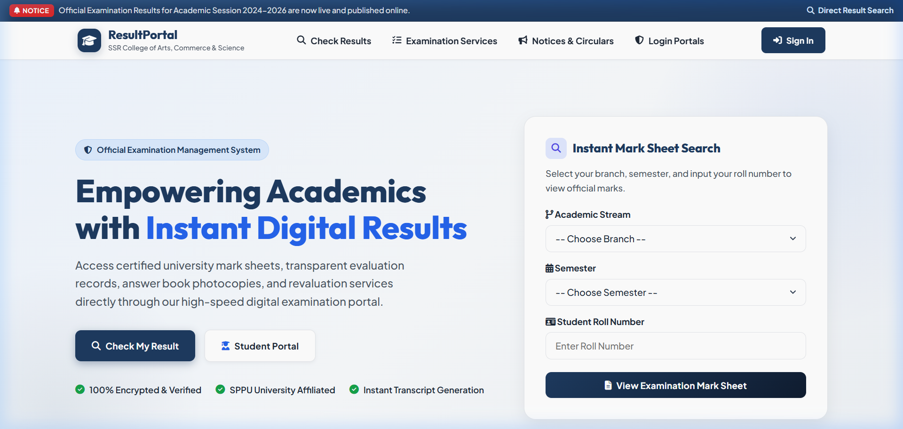
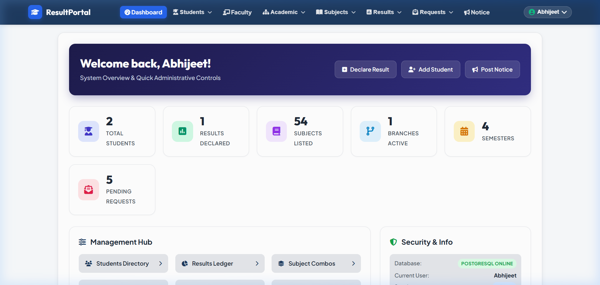
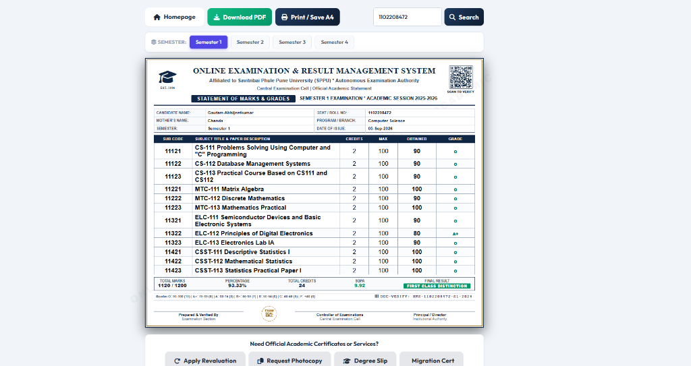
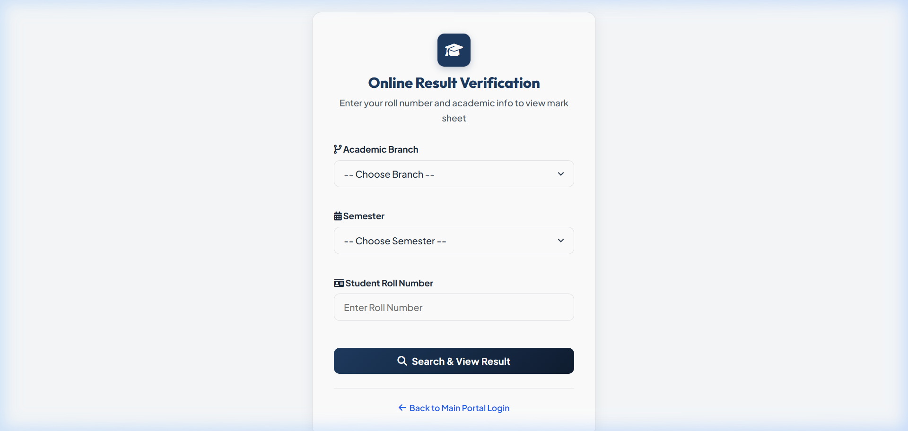
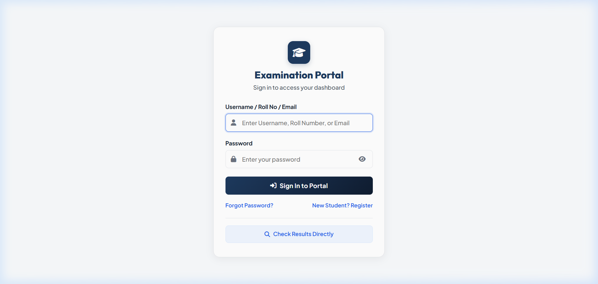
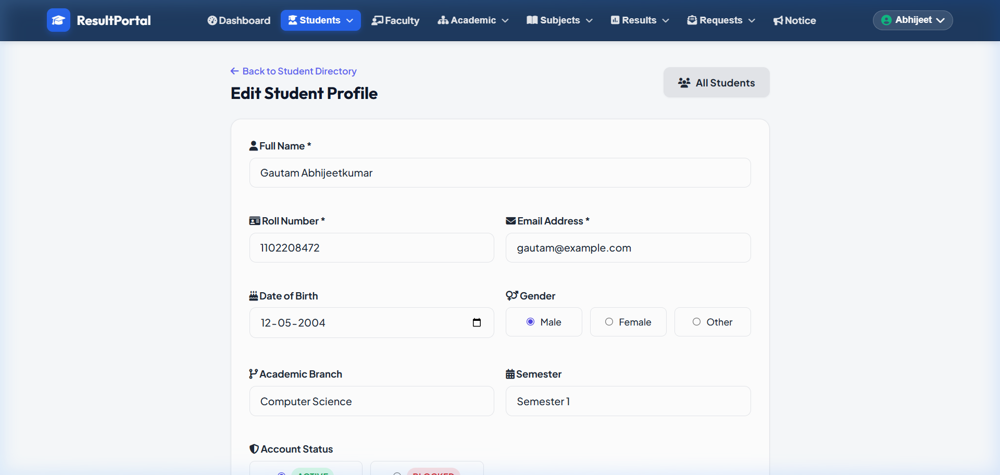

<div align="center">

# 🎓 Online Examination & Result Management System

**A Modern, Secure, Full-Stack Academic Portal built with PHP 8.2 & PostgreSQL**

[](https://online-results.vercel.app/)

[](https://www.php.net/)
[](https://www.postgresql.org/)
[](https://online-results.vercel.app/)
[](https://www.cloudflare.com/)
[](https://razorpay.com/)
[](LICENSE)

### 🔗 Live Production URL: [https://online-results.vercel.app/](https://online-results.vercel.app/)

*Central Examination Division & Academic Student Services Portal*

[🌐 Open Live Demo](https://online-results.vercel.app/) • [Key Features](#-key-features) • [Deployment Guide](#-free-cloud-deployment) • [Credentials](#-default-credentials)

</div>

---

## 🌟 Overview

The **Online Result Management System** is an enterprise-grade academic web application designed to automate the entire examination lifecycle for universities and colleges. It provides dedicated role-based portals for **Students**, **Faculty Members**, and **Examination Administrators**, complete with automated GPA calculation, answer book photocopy requests, subject revaluation, Razorpay payment gateway integration, and printable digital receipts with QR code verification.

---

## ✨ Key Features

### 👨‍🎓 Student Portal
- **Direct Result Search**: Quick public search by Roll Number and Mother's Name.
- **Answer Book Photocopy**: Multi-subject selection with dynamic fee calculation (₹100/subject).
- **Subject Revaluation**: Policy-restricted application system allowing revaluation only for photocopy-verified subjects (₹250/subject).
- **Payment Gateway**: Animated Razorpay Checkout modal with support for UPI (GPay, PhonePe, Paytm), Cards, NetBanking, and Instant Verification bypass.
- **Single-Page Fee Receipt**: Professional printable fee voucher with dynamic QR verification code (`Scan to Verify`), itemized subject breakdown, and amount in words.
- **Academic Documents**: Generate provisional certificates, degree transcripts, and printable grade cards.

### 👨‍🏫 Faculty Portal
- **Role-Based Authentication**: Secure login for department professors and evaluators.
- **Course & Marks Entry**: Add, update, and manage student marks by subject and semester.
- **Student Directory**: Access department student lists, registration profiles, and performance metrics.

### 🛡️ Administration Portal
- **System Overview Dashboard**: Live analytics for total students, declared results, active branches, listed subjects, and pending request queues.
- **Course & Branch Management**: CRUD controls for branches, semesters, subjects, and subject combinations.
- **Bulk Uploaders**: CSV/Excel bulk upload for student registrations and marks sheets.
- **Public Circulars & Notices**: Publish announcements and circulars directly to the student portal.
- **Audit Logging**: Comprehensive security audit trail recording IP addresses, user roles, timestamps, and administrative actions.

---

## 📸 Screenshots

### 🌐 Public Landing & Examination Portal


### 📊 Administrative Command Center & Analytics Dashboard


### 📜 Official Student Marksheet & Academic Transcript


### 🔍 Online Result Verification & Instant Search


### 🔐 Secure Multi-Role Portal Authentication


### 📝 Result Declaration & Subject Grading System


### 👥 Student Directory & Records Management


---

## 🏗️ System Architecture

```text
┌───────────────────────────────────────────────────────────┐
│                    STUDENTS & USERS                       │
└─────────────────────────────┬─────────────────────────────┘
                              │
                              ▼
┌───────────────────────────────────────────────────────────┐
│           CLOUDFLARE EDGE CDN & DDoS PROTECTION           │
│   (Global DNS, SSL Termination, Asset Caching & WAF)      │
└─────────────────────────────┬─────────────────────────────┘
                              │
                              ▼
┌───────────────────────────────────────────────────────────┐
│                 VERCEL SERVERLESS PHP 8.2                 │
│   (Dynamic Routing via api/index.php, Gzip Compression)   │
└─────────────────────────────┬─────────────────────────────┘
                              │
                              ▼
┌───────────────────────────────────────────────────────────┐
│              NEON.TECH POSTGRESQL DATABASE                │
│   (Connection Pooling, SSL, Indexes & Foreign Keys)       │
└───────────────────────────────────────────────────────────┘
```

---

## 🚀 Free Cloud Deployment

Deploy this system completely free in **3 simple steps**:

### 1. Database Setup on [Neon.tech](https://neon.tech/)
1. Create a free PostgreSQL project on Neon.
2. In the **SQL Editor**, paste and run the [`database_schema.sql`](database_schema.sql) file.
3. Copy your `DATABASE_URL` connection string.

### 2. Backend Deployment on [Vercel](https://vercel.com/)
1. Import this repository into Vercel.
2. Add the environment variable:
   - `DATABASE_URL` = *(Paste your Neon connection string)*
3. Click **Deploy**. Vercel will automatically build the serverless PHP runtime using [`vercel.json`](vercel.json).

### 3. Optional: Cloudflare Custom Domain
1. In Cloudflare DNS, add a `CNAME` pointing your domain to `cname.vercel-dns.com` (Proxied 🟠).
2. In Vercel Project Settings $\rightarrow$ Domains, add your domain.

---

## 💻 Local Installation

### Requirements:
- PHP 8.1 or higher (with `pdo_pgsql` and `pgsql` extensions enabled)
- PostgreSQL 14 or higher
- Web Server (Apache / Nginx / PHP built-in server)

### Steps:
```bash
# 1. Clone the repository
git clone https://github.com/Abhijeet0848/Result-management.git
cd Result-management

# 2. Configure Environment Variables
cp .env.example .env
# Edit .env with your local PostgreSQL credentials

# 3. Import Database
psql -U postgres -d result -f database_schema.sql

# 4. Start Local PHP Development Server
php -S localhost:8000
```
Visit `http://localhost:8000` in your browser.

---

## 🔑 Default Credentials & Live Portal Links

| Portal | Live Access Link | Default Username | Default Password |
| :--- | :--- | :--- | :--- |
| **Admin Portal** | [Open Admin Portal](https://online-results.vercel.app/frontend/pages/auth/index.php) | `admin` | `Test@123` |
| **Faculty Portal** | [Open Faculty Portal](https://online-results.vercel.app/frontend/pages/auth/index.php) | `faculty@example.com` | `faculty123` |
| **Student Portal** | [Open Student Portal](https://online-results.vercel.app/frontend/pages/student/s_login.php) | `gautam@example.com` | `1102208472` |
| **Direct Result Search** | [Search Result Online](https://online-results.vercel.app/frontend/pages/auth/find-result.php) | *Public Access* | *Public Access* |

---

## 📁 Repository Structure

```text
Online-result-system/
├── api/
│   └── index.php             # Vercel serverless router with Gzip & asset caching
├── backend/
│   ├── api/                  # AJAX endpoints (create_order, fetch_students, get_marks)
│   ├── auth/                 # Authentication & logout handlers
│   ├── config/               # Database connection pooler (connection.php, session.php)
│   └── helpers/              # Academic calculations & security audit logger
├── database/
│   └── final2.sql            # Legacy schema backup
├── database_schema.sql       # Production-ready PostgreSQL schema & seed data
├── docs/
│   └── screenshots/          # High-resolution application UI screenshots
├── frontend/
│   ├── assets/               # Stylesheets (common.css), vector icons, QR scripts
│   ├── components/           # Shared UI navigation & footer headers
│   └── pages/
│       ├── admin/            # CRUD management (students, faculty, results, circulars)
│       ├── auth/             # Multi-role authentication & password recovery
│       ├── faculty/          # Marks ledger & grading dashboard
│       └── student/          # Result viewing, photocopy, revaluation & receipt download
├── Dockerfile                # Production container configuration
├── vercel.json               # Serverless PHP runtime & security header config
├── .env.example              # Environment variables template
├── .gitignore                # Protected secret files & logs
├── LICENSE                   # MIT License
└── README.md
```

---

## 🛡️ Security

- **Zero Hardcoded Secrets**: All passwords and API keys are isolated in `.env` and environment variables.
- **SQL Injection Prevention**: All database interactions use parameterized queries (`pg_query_params`).
- **XSS & CSRF Protection**: Session token validation and HTML entity sanitization on all inputs.
- **HTTP Security Headers**: `X-Content-Type-Options: nosniff`, `X-Frame-Options: SAMEORIGIN`, `X-XSS-Protection`.

---

## 📄 License

This project is open-source and licensed under the [MIT License](LICENSE).

---

<div align="center">
Made with ❤️ by <strong>Abhijeet</strong> • Online Examination & Result Management System
</div>
